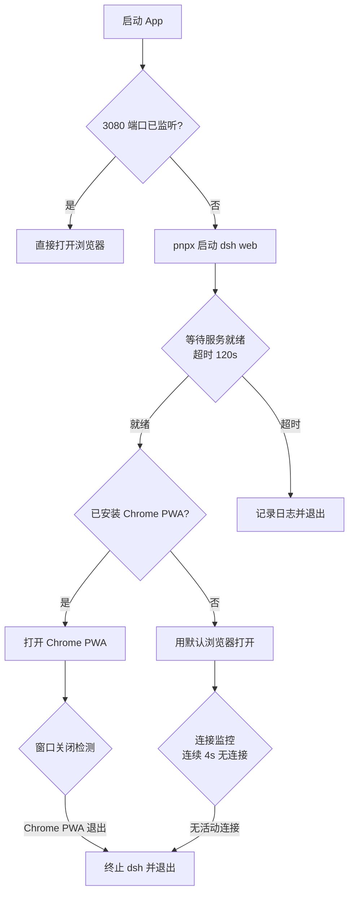

# DeepSeek Harness Launcher

macOS 原生启动器，一键启动 DeepSeek Harness 本地服务（`dsh`）并自动打开浏览器；关闭浏览器窗口即自动终止服务，不留后台残留进程。

## 功能特性

- **自动启动服务**：通过 `pnpx @deepseek-ai/dsh web` 拉起 dsh 本地服务（端口 `3080`）
- **自动唤起浏览器**：服务就绪后优先打开 Chrome 安装的 DeepSeek Harness PWA，未安装则用默认浏览器
- **随窗口自动退出**：关闭 Chrome PWA 窗口即终止 dsh 进程并退出 App，无残留
- **端口冲突兜底**：检测到 `3080` 已被占用时直接打开浏览器，不重复启动服务
- **原生图标**：按 Apple Big Sur 图标规范生成的 `.icns`（浅灰蓝 + 蓝色 D 符号）
- **完整日志**：所有运行事件写入 `/tmp/dsh-launcher.log`，方便排查

## 工作原理



两条退出路径互为兜底：

1. **进程通知**：监听 `NSWorkspace` 的 `didTerminateApplicationNotification`，识别 `com.google.chrome.app.*` 前缀的 PWA 进程退出
2. **连接监控**：每 2 秒用 `lsof` 统计端口 `3080` 的 ESTABLISHED 连接数，连续 2 次（约 4 秒）无连接即退出（覆盖 `--app` 模式关窗但不退出 Chrome 主进程的场景）

> 注意：App 启动后 2 秒内的 Chrome 进程退出会被忽略，避免误判 PWA 初始化时的临时进程。

## 环境要求

| 依赖 | 说明 |
|------|------|
| macOS 11+ | 图标按 Big Sur 规范生成；代码无高版本 API 依赖 |
| Xcode Command Line Tools | 提供 `swiftc`、`iconutil`、`sips`，运行 `xcode-select --install` 安装 |
| pnpm | 提供 `pnpx` 命令；`brew install pnpm` 或 `npm install -g pnpm` 安装 |
| Google Chrome（可选） | 安装 PWA 后获得"关窗口即退出"的最佳体验，未安装时自动回退默认浏览器 |

## 构建

```bash
cd deepseek-harness-app
bash build-dsh-app.sh
```

构建脚本完成四件事：

1. `gen-icon.swift` 用 Core Graphics 绘制 10 个尺寸的 PNG（16 → 1024，含 @2x）
2. `iconutil` 合并为 `.icns`
3. `swiftc` 编译 `dsh-app.swift` 为可执行文件
4. 组装 `.app` bundle 并写入 `Info.plist`

产物为 `./DeepSeekHarnessLauncher.app`。

## 安装

1. 将 `DeepSeekHarnessLauncher.app` 拖入 `/Applications`
2. 双击运行；关闭浏览器窗口（或 PWA 窗口）即自动退出

首次运行会通过 `pnpx` 下载并启动 `@deepseek-ai/dsh`，可能耗时数十秒，之后启动即秒开。

### 推荐：安装 Chrome PWA

在 Chrome 中打开 `http://127.0.0.1:3080`，点击地址栏右侧的"安装"图标（或菜单 → 保存并分享 → 安装页面），安装为独立窗口 App。之后 Launcher 会优先以独立窗口启动，关闭该窗口即可干净退出。

## 项目结构

```
deepseek-harness-app/
├── dsh-app.swift              # 主程序（Cocoa AppDelegate，进程管理与退出逻辑）
├── gen-icon.swift             # 图标生成脚本（Core Graphics，Big Sur 规范）
├── build-dsh-app.sh           # 一键构建脚本（图标 → icns → 编译 → bundle）
├── measure-icon.swift         # 图标尺寸验证工具（开发用，对比内边距）
├── dsh-icon-preview.png       # 图标预览图
└── DeepSeekHarnessLauncher.app  # 构建产物（运行 build-dsh-app.sh 生成）
```

## 配置说明

| 项 | 位置 | 默认值 |
|----|------|--------|
| 服务端口 | `dsh-app.swift` 中 `DSH_URL` | `http://127.0.0.1:3080` |
| 服务启动命令 | `dsh-app.swift` 中 `startDSH()` | `pnpx @deepseek-ai/dsh web` |
| 日志路径 | `dsh-app.swift` 中 `LOG_PATH` | `/tmp/dsh-launcher.log` |
| PWA 查找目录 | `dsh-app.swift` 中 `findInstalledChromeApp()` | `~/Applications/Chrome Apps.localized` |
| PATH 补充 | `dsh-app.swift` 中 `startDSH()` | `~/Library/pnpm/bin:/opt/homebrew/bin:/usr/local/bin` |
| App 标识 | `build-dsh-app.sh` 生成的 `Info.plist` | `com.deepseek.harness-launcher` |

## 图标设计说明

`gen-icon.swift` 遵循 Apple Big Sur 图标规范：

- **留白**：squircle 四周保留 10% 透明边距，图形占画布 80%，保证在 Launchpad / Dock 中与其他 App 图标同尺寸显示
- **圆角**：圆角半径约为 squircle 宽度的 22.37%
- **配色**：浅灰蓝背景 `#F5F7FA` + 蓝色 D 符号 `#007ACC`
- **符号**：D 字母造型（圆弧 + 竖线），占逻辑尺寸约 27%

修改配色或图形后重新运行 `bash build-dsh-app.sh` 即可生效。

## 常见问题

**Q：图标看起来比其他 App 大？**

旧版本图标背景贴满画布（100%）导致 Launchpad 渲染偏大约 20%，已按规范修复为 80%。若仍异常，删除 `/Applications` 下的旧 App 后重新构建、拖入，并执行 `killall Dock` 刷新图标缓存。

**Q：点击 App 没反应？**

查看日志：`tail -f /tmp/dsh-launcher.log`。常见原因：`pnpm` 未安装、首次下载 `@deepseek-ai/dsh` 较慢（超时 120 秒）、端口被其他程序占用。

**Q：端口 3080 被其他程序占用了？**

日志会提示"端口 3080 已被占用"，App 会直接打开浏览器，不会尝试启动第二个服务实例。

**Q：关闭窗口后 dsh 进程还在？**

检查 Chrome PWA 是否真的退出了（`--app` 窗口关闭不退出 Chrome 主进程，但 PWA 独立窗口是独立进程）。连接监控兜底会在约 4 秒内终止服务并退出 App。

**Q：如何完全卸载？**

删除 `/Applications/DeepSeekHarnessLauncher.app` 即可；dsh 及日志（`/tmp/dsh-launcher.log`）如有残留可手动清理。

## 开发调试

```bash
# 实时查看运行日志
tail -f /tmp/dsh-launcher.log

# 手动验证图标尺寸是否符合规范（对比其他 App）
swift measure-icon.swift /path/to/YourApp.icns /Applications/WeChat.app/Contents/Resources/AppIcon.icns
```
