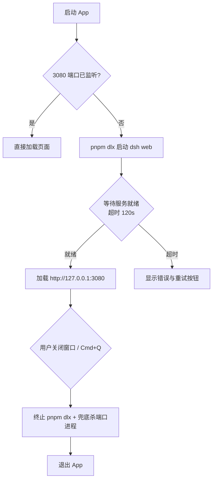

# DeepSeek Harness Launcher

macOS 原生启动器：一键启动 DeepSeek Harness 本地服务（`dsh`），并以内嵌 WKWebView 呈现界面；退出 App 即自动终止服务，不留后台残留进程。

## 功能特性

- **内嵌 WebView**：不依赖 Chrome/浏览器，界面直接渲染在 App 窗口内（WKWebView，持久化数据存储，保留登录态）
- **自动启动服务**：通过 `pnpm dlx @deepseek-ai/dsh web` 拉起 dsh 本地服务（端口 `3080`）
- **启动等待画面**：服务就绪前显示加载动画，就绪后自动导航到 `http://127.0.0.1:3080`；加载失败可一键重试
- **退出自动清理**：关闭窗口 / Cmd+Q 退出时终止 pnpm dlx 进程，并兜底杀掉监听 3080 端口的进程，无残留
- **端口冲突兜底**：检测到 `3080` 已被占用时直接加载页面，不重复启动服务
- **站外链接外投**：`127.0.0.1` 之外的链接交给系统默认浏览器打开，站内保持内嵌
- **通用二进制**：直接支持 Intel (x86_64) 与 Apple Silicon (arm64)
- **完整日志**：所有运行事件写入 `/tmp/dsh-launcher.log`，方便排查；**页面内 JS 的 console 日志与报错也会转发到该日志**（通过 console-bridge.js 注入）
- **实时版本**：「关于」对话框显示 **dsh 启动后实际运行**的版本（启动成功时异步预取一次并缓存，多次打开不重复请求，避免版本漂移）

## 工作原理



## 环境要求

| 依赖 | 说明 |
|------|------|
| macOS 12+ | 构建目标为 macOS 12.0 起的通用二进制；**推荐 macOS 26**（见下方说明） |
| Node.js ≥ 20 | `@deepseek-ai/dsh` 运行时依赖 Node；推荐 **24 LTS**（当前 LTS，支持至 2028 年） |
| pnpm ≥ 10 | 提供 `pnpm dlx` 命令；推荐 **11.x**；安装：`brew install pnpm` 或 `npm install -g pnpm` |
| Xcode Command Line Tools | 提供 `swiftc`、`lipo`、`hdiutil`，运行 `xcode-select --install` 安装 |

> **推荐使用最新的 macOS 26**：App 内嵌的 WKWebView 使用**系统自带的 WebKit 引擎**（与 Safari 同源），渲染能力随系统版本走——macOS 12 对应 Safari 15 的引擎，只有新版系统才具备 WebGPU、容器查询等现代 Web 能力。应用本身兼容 macOS 12+，但在 macOS 26 上页面的 Web 能力最完整、体验最佳。

## 构建

```bash
cd dsh-app
bash build-dsh-app.sh 0.1.0                 # 仅 .app（Universal）
bash build-dsh-app.sh 0.1.0 --dmg           # .app + Universal DMG
bash build-dsh-app.sh 0.1.0 --arch arm64    # 仅 arm64 .app
bash build-dsh-app.sh 0.1.0 --arch x86_64 --dmg  # x86_64 .app + DMG
bash build-dsh-app.sh 0.1.0 --dmg --no-app  # 仅 Universal DMG（构建后删除 .app）
bash build-dsh-app.sh                       # 显示帮助信息
```

- **版本号必传（第一个参数）**：如 `0.1.0`，写入 Info.plist 并用于 DMG 命名；`--dmg` / `--no-app` / `--arch` 可选，顺序可调
- **`--dmg` 可选**：额外生成 `dsh-app-<版本>.dmg`（内含 App 与 /Applications 链接，拖入即安装）
- **`--no-app` 可选**：须与 `--dmg` 搭配使用，DMG 生成成功后自动删除 `.app` 产物，避免分发时残留；单独使用会报错退出
- **`--arch` 可选**：指定单一架构 `x86_64` 或 `arm64`，只编译对应二进制，DMG 命名为 `dsh-app-<版本>-<架构>.dmg`；不传则构建 Universal 二进制，DMG 命名为 `-universal`
- **无参数运行**：仅显示帮助信息，不进行构建
- 构建产物：`dsh-app.app`（默认 Universal 二进制，x86_64 + arm64，最低 macOS 12.0）

## 项目结构

```
dsh-app/
├── dsh-app.swift      # 主程序（WKWebView 内嵌窗口、进程管理与退出清理）
├── build-dsh-app.sh   # 一键构建脚本（图标 → 双架构编译 → bundle → 可选 DMG）
├── icon.icns          # 应用图标
└── dsh-app.app/       # 构建产物（运行脚本生成，已 gitignore）
```

## 配置说明

| 项 | 位置 | 默认值 |
|----|------|--------|
| 服务地址 | `dsh-app.swift` 中 `DSH_URL` | `http://127.0.0.1:3080` |
| 服务启动命令 | `dsh-app.swift` 中 `launchDSH()` | `pnpm dlx @deepseek-ai/dsh web` |
| About 版本获取 | `dsh-app.swift` 中 `prefetchDSHVersion()` | dsh 启动成功后异步执行 `pnpm dlx @deepseek-ai/dsh --version` 一次并缓存（超时 20s，失败缓存为“未知”） |
| 日志路径 | `dsh-app.swift` 中 `LOG_PATH` | `/tmp/dsh-launcher.log`（时间戳为北京时间） |
| PATH 补充 | `dsh-app.swift` 中 `startDSH()` | `~/Library/pnpm/bin:/opt/homebrew/bin:/usr/local/bin` |
| 最低系统 | `build-dsh-app.sh` 中 `MIN_MACOS` | `12.0` |
| App 标识 | `build-dsh-app.sh` 生成的 Info.plist | `com.deepseek.harness-launcher` |

## 常见问题

**Q：点击 App 没反应？**

查看日志：`tail -f /tmp/dsh-launcher.log`。常见原因：`Node.js` / `pnpm` 未安装（版本要求见上方「环境要求」）、首次下载 `@deepseek-ai/dsh` 较慢（超时 120 秒）、端口被其他程序占用。

**Q：端口 3080 被其他程序占用了？**

日志会提示"端口 3080 已被占用"，App 会直接加载页面，不会尝试启动第二个服务实例。

**Q：启动失败/超时怎么办？**

等待画面会显示错误信息并提供"重试"按钮；也可在终端手动运行 `pnpm dlx @deepseek-ai/dsh web` 排查服务本身的问题。

**Q：如何完全卸载？**

删除 `/Applications/dsh-app.app` 即可；dsh 及日志（`/tmp/dsh-launcher.log`）如有残留可手动清理。

## 开发调试

```bash
# 实时查看运行日志
tail -f /tmp/dsh-launcher.log

# 确认产物为通用二进制且最低版本正确
file dsh-app.app/Contents/MacOS/dsh-app
vtool -show-build dsh-app.app/Contents/MacOS/dsh-app
```